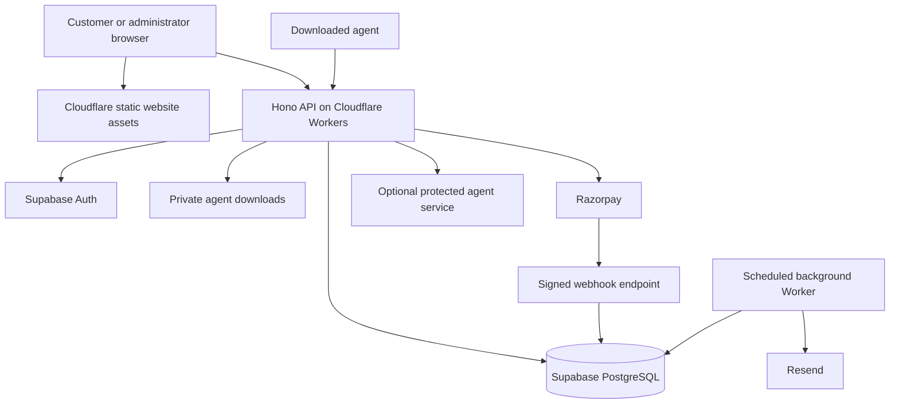

# Architecture and Technology Choices

## Recommended design

Use one repository with a frontend, backend, shared validation contracts, database migrations, and agent-integration specifications. Keep the commerce/licensing backend small. Actual agent execution is a separate workload whose hosting depends on what the three products do.

## Technology responsibilities

| Layer | Choice | Why it fits |
|---|---|---|
| Public pages | Astro static generation | Fast, indexable marketing pages with little browser JavaScript |
| Interactive screens | React + TypeScript | Reusable account, checkout, and administration components |
| Styling | Tailwind CSS + accessible UI primitives | Consistent responsive design with keyboard support |
| Backend | Hono + TypeScript on Cloudflare Workers | Small HTTP API, web-standard cryptography, shared language |
| Validation | Zod shared schemas | Explicit validation of requests and responses |
| Database | Supabase PostgreSQL | Transactions, constraints, relational customer/payment/license data |
| Authentication | Supabase Auth through backend session handling | Managed password handling, verification, recovery, MFA |
| Downloads | Supabase private Storage initially | Authorized, short-lived download links |
| Payments | Razorpay hosted Checkout | UPI and cards; international methods subject to merchant approval |
| Email | Resend API and SMTP | Purchase messages plus custom SMTP for authentication |
| Testing | Vitest + Playwright + SQL/RLS integration tests | Business invariants, browser journeys, tenant isolation |
| Delivery | Git + GitHub Actions + Wrangler | Repeatable validation and deployment from a private repository |

Astro supports pre-rendered pages and optional on-demand routes. This proposal deliberately starts with static pages and authenticated API calls, avoiding an SSR adapter requirement. [Astro rendering documentation](https://docs.astro.build/en/guides/on-demand-rendering/). Hono has a documented Workers deployment path. [Hono documentation](https://hono.dev/docs/getting-started/cloudflare-workers).

Pin compatible stable versions and a lockfile during implementation; verify Workers compatibility before choosing dependencies. Do not assume Node-only packages work in an edge runtime.

## Request routing and trust boundaries

- One website origin serves static assets and `/api/*`. Configure Worker routing so API requests always reach the API rather than the static fallback.
- Static account/admin pages contain only an empty interface shell. Private data comes from authorized API requests and is never embedded in public build output.
- The backend manages secure HttpOnly, Secure, SameSite cookies and verifies sessions on protected requests. Authentication callbacks complete on the backend; tokens do not appear in URLs or logs after the callback.
- Use the user's verified identity for normal database access with row-level security (RLS). Internal fulfillment/admin operations use narrowly scoped server-only database functions or credentials. Elevated credentials bypass RLS, so those paths must also authorize explicitly.
- Browser-supplied user IDs, prices, payment statuses, roles, or product permissions are never authoritative.
- Agent requests use a separate activation/device-session protocol, not browser cookies. Browser CSRF defenses and agent token validation are different controls.
- Auth, billing, key reveal, admin, and download-link responses use `Cache-Control: no-store` and must bypass shared caches.
- Backend secrets live in deployment secret storage. The browser and downloaded agents never receive database admin, payment, email, or AI-provider secrets.

## API surface planned for version one

| Route | Purpose and authorization |
|---|---|
| `GET /api/products` | Public active products; only published fields |
| `POST /api/auth/register`, `/login`, `/logout` | Managed authentication; abuse controls and CSRF as appropriate |
| `POST /api/auth/forgot-password`, `/reset-password` | Recovery through verified expiring flows |
| `GET /api/auth/callback` | Complete provider verification/sign-in flow |
| `GET/PATCH /api/me` | Read/update an allowlist of the current user's profile fields |
| `GET /api/me/licenses`, `/orders`, `/subscriptions` | Current user's records only |
| `POST /api/orders` | Compute price on server and create provider order |
| `GET /api/orders/:id` | Owner-only payment/fulfillment status |
| `POST /api/webhooks/razorpay` | Raw-body signature verification; no browser session required |
| `POST /api/licenses/:id/reveal` | Owner or authorized admin; recent reauthentication; audit |
| `POST /api/licenses/:id/download` | Current entitlement check; return expiring storage URL |
| `POST /api/licenses/:id/devices/:deviceId/deactivate` | Owner or admin; atomic device release |
| `POST /api/subscriptions/:id/cancel` | Owner or admin; request provider cancellation and reconcile |
| `POST /api/agent/activate` | Product-specific key validation and atomic device allocation |
| `POST /api/agent/refresh`, `/deactivate` | Device session proof; live entitlement verification |
| `GET /api/admin/customers`, `/licenses`, `/orders` | Admin authorization + MFA; filtered, paginated results |
| `POST /api/admin/licenses/:id/revoke`, `/restore`, `/rotate` | MFA, reason, audit, transactional mutation |
| `POST /api/admin/orders/:id/refund` | Explicit refund operation through provider, reconciled asynchronously |
| `POST/PATCH /api/admin/products` | Role-permitted catalog management; validate release metadata |
| `GET /api/admin/events`, `/email-deliveries` | Operational visibility without exposed secrets |
| `POST /api/support` | Validated support submission with rate limits |

Use stable machine-readable error codes, correlation IDs, pagination, body-size limits, and idempotency keys for purchase actions. Publish a versioned agent protocol before shipping binaries. Do not return customer identity from the public activation endpoint.

## Background work and consistency

A separate scheduled Worker claims small batches from a PostgreSQL outbox using a lease/locking function. It sends emails, reconciles unresolved payments/cancellations, and records retry state. Tasks survive restarts because they are persisted before success is acknowledged. Retries use backoff, bounded attempts, and an admin-visible failed state. Keep batches within hosting quotas; move to a dedicated queue when volume warrants it.

The purchase transaction writes the license and email job together. The email system being unavailable does not undo a paid license. Renewal webhooks cannot override an owner's manual revocation flag.

## Optimization targets

- Static public HTML, responsive compressed images, lazy-loaded demos, font subsetting, and no large autoplay video.
- Target mobile LCP <= 2.5 seconds, INP <= 200 ms, CLS <= 0.1; measure real pages rather than promise scores.
- Cache public product content with a defined rebuild/invalidation path after admin edits. Checkout always reads current server pricing.
- Index customer ownership, license lookup, provider event IDs, and due-job timestamps. Paginate dashboards and select only needed fields.
- Locate the database near initial customers; measure edge-to-database round trips. Edge hosting alone does not guarantee low latency.
- Track p95 API latency, errors, CPU, database load, email delays, and payment-to-license time. Set budgets after a realistic load test.
- Keep agent binaries out of the website bundle. Signed storage URLs avoid proxying large downloads through the API.

## Upgrade Two: staff and editable catalog

Add dedicated admin login, owner-controlled staff invitations, fixed permission roles, and structured product/content editors. Every staff API operation checks current active membership, required permission, and MFA; a hidden route is not authorization. Customers remain visible even without orders through a customer-first directory query.

Products and supported content live in database revisions. Publishing queues an authenticated automated build from an approved snapshot, including new product and checkout routes. Show revision-specific publication status; checkout checks current availability and price independently. No manual source edits are needed to add catalog entries. Draft content is never included in public builds or APIs.

Add team/invitation, content, release-upload, publish, and publication-status APIs with the boundaries specified in [Upgrade Two](./07-upgrade-two-admin-and-team.md). The same document defines fixed roles; existing references to admin authorization mean the required action permission, not unrestricted access for every staff member.

## Growth path

First scale within this architecture: paid database reliability, higher Worker quotas, larger private download storage, and a durable queue. Add separate agent execution services only for actual product requirements. Long-running automation, browsers, GPU jobs, and arbitrary Python programs do not belong in a small licensing Worker.
